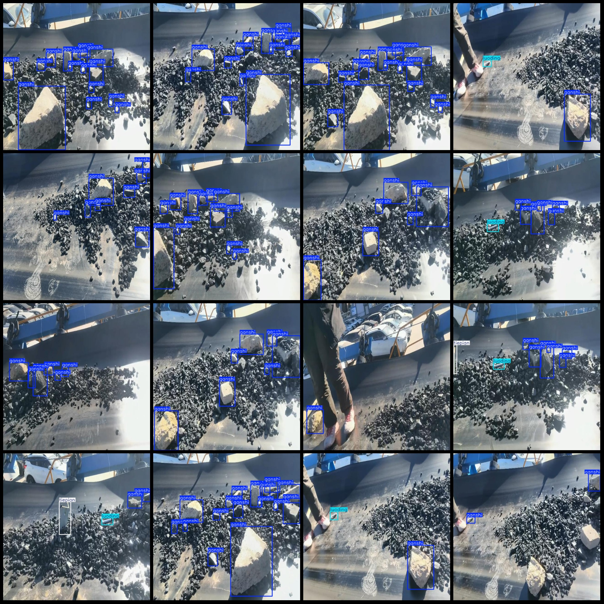
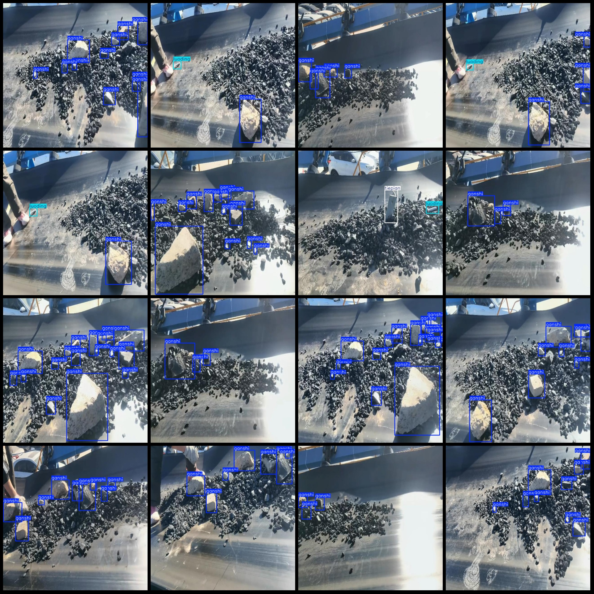

# Coal Mine conveyor belt with foreign object detection dataset (VOC+YOLO format, 384 images, 4 categories)

Dataset format: Pascal VOC format + YOLO format (txt file without split path, only containing jpg images and corresponding VOC format xml files and YOLO format txt files)
Number of images (jpg file count): 384
Number of annotations (xml file count): 384
Number of annotations (txt file count): 384
Number of annotation classes: 4
Annotation class names in yolo format (note that the order of classes in the yolo format does not correspond to this, but is based on the labels folder's classes.txt): ["ganshi", "gunzi", "luoding", 
"tiepian"]
Each category of annotations:
- ganshi (granite) annotation count = 2424
- gunzi (stick) annotation count = 1
- luoding (nail) annotation count = 157
- tiepian (iron piece) annotation count = 87
Total annotations: 2669
Image resolution: 640x640
Annotation tool used: labelImg
Annotation rules: draw a bounding box for each category
Important note: The dataset does not have a training/validation/test split; you need to partition it yourself.
Special declaration: This dataset does not guarantee the accuracy of the trained model or weight files.
Image preview:

## Images

Here is a pay link on Stripe ( https://buy.stripe.com/3cs8yP7sY87d0vu9AB ). Please contact me lonlonago@foxmail.com after funding $89, and I will send you a complete data files , thank you!

